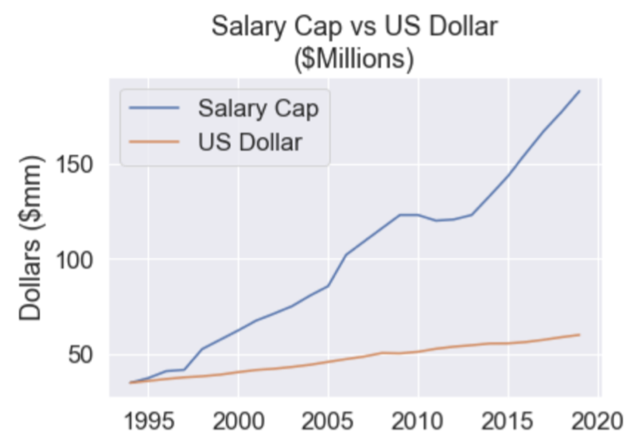
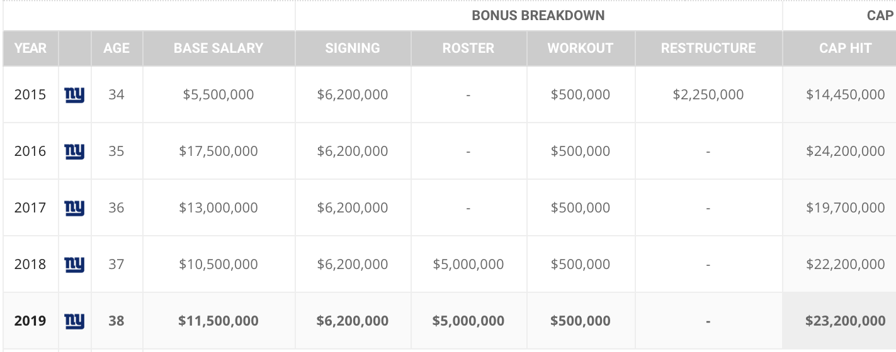
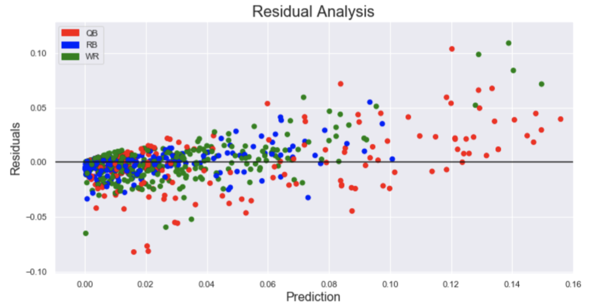

## **Predicting NFL Player Compensation**
Updated on 10/06/19

---

## Summary  
I created a linear regression model to predict the compensation for NFL players based on past game performance and previous contract sizes.  The goal is to project the compensation for a player to find who is being underpaid / overpaid or to project the contract size for an upcoming free agent player.

---

## Key Components and Assumptions

**Years for analysis = 1994 to 2019**
> The NFL salary cap was established in 1994 as a way to keep teams balanced.  Starting at $34 million in 1994, the cap has steadily increased every year to the current limit of $188 million in 2019.*  My analysis of salaries will start in 1994 because prior to the salary cap player salaries were much less consistant. 
>
> `NOTE` - all game stats look at the prior season, so stats will be collected for 1993 to 2018.  These will be paired with compensation numbers from 1994 to 2019.
> 
> \* There was technically no salaray cap during the 2010 season due to ongoing negotiations related to player benefits (CBA agreement).  At the time teams opporated as if the prior year cap was in place because they knew once negotiations were complete the salary cap would be reinstated.

**Pct of Cap = Player Compensation / Salary Cap**

> To compare players across different time periods, compensation is converted to "Pct of cap", which is  the player's compensation for a given year divided by the salary cap of the same year.  A player making up 10% of a team's cap in 1994 should be comparable to a player making up 10% of the cap in 2019.  Most players make up less than 5% of a team's salary cap, but superstars can account for almost 20% in some cases.
> 
> A reasonable question is why don't we just inflation adjust the dollars instead of dividing by the salary cap.  The reason is the NFL salary cap increases faster than the rate of inflation, modern players would always seem more expensive on average (see below).
>
> 

**Player Compensation = Annual salary + relevant bonuses**

> NFL player contracts consist of an annual salary (typically the largest part) and a combination of bonuses such as a signing bonus, workout bonus, roster bonus, and/or others.  Bonus money can be spread out over multiple years, which can be especially useful for teams close to their salary cap limit and who cannot affort a large cost in the current year.  As a result, when looking at a player's compensation, this will include all components of salaries and bonuses for the year.  Below is Eli Manning's most recent contract for example.
> 

**Players in scope are Quarterbacks (QBs), Running Backs (RBs), and Wide Recievers (WRs)**

> The only players I will be focusing on are QBs, RBs, and WRs.  This is becuase these positions have the most game stats associated with them (sorry offenseive lineman).  In the future I may be able to expand to additional positions with the avalibility of additional positional statistics.

---

## Data Collection 
There are 2 data sources for this project:
 1. **spotrac.com:** Details about player contracts for each year.  Includes salary and bonuses.

 2. **pro-football-reference.com:**  Gameplay statistics for all NFL players.  

**Summary of Baseline Features**  

| General Features | Passing Features   | Rushing Features          | Receiving Features |
| ---------------- |------------------- | ------------------------- | ---|
| Position         | Pass Attempts      | Rush Attempts             | Passing Targets |
| Age              | Pass Completions   | Rush Yards                | Receptions |
| Games Played     | Pass Completions % | Rushing Touchdowns        | Catch % |
| Games Started    | Passing Yards      | Longest Rushing Attempt   | Receiving Yards |
| Fumbles          | Passing Touchdowns | Rushing Yards per Attempt | Receiving Yards per Reception |
| Previous Comp    | Interceptions      | Rushing Yards per Game    | Receiving Touchdowns |
|                  | Longest Completion           || Longest Reception |
|                  | Passing Yards per Attempt    || Receiving Yards per Target |
|                  | Passing Yards per Completion || Receptions per Game |
|                  | Passing Yards per Game       || Receiving Yards per Game |
|                  | QB Rating                    ||
|                  | Game Winning Drives          ||
|                  | 4th Quarter Comebacks        |
|                  | Wins / Losses / Ties         |

---

## Feature Engineering  
There are 2 key stratagies to engineer features:
1. Adjusting Stats by Year
2. Classifying "Superstars"

**Adjusting Stats by Year:**  The stratagies of NFL coaches has evolved over time and can be seen as multi-year trends.  Most notable is the shift to offenses based around passing rather than rushing (see table below).  This means stats of players across different time periods may be difficult to compare.
 
| Years | 4,000+ Passing Yard Seasons | 5,000+ Passing Yard Seasons |
| ----- | :---: | :---: |
| 1995 - 1999 | 14 | 0 |
| 2000 - 2004 | 16 | 0 |
| 2005 - 2009 | 30 | 1 |
| 2010 - 2014 | 46 | 6 |

To solve this problem, I have created "adjusted" which normalize the values by year.  For a given stat catagory and a given year, the league leader of that stat will have an adjusted value of 1, while the worst player has an adjusted value of 0.  All players in between are given an adjusted value between 0 and 1 that is proportional to their standing (see example below).  The adjusted stats were calculed for all baseline stats across each year of analysis, allowing us to compare a league leader from 1993 to 2019 by how much better they were than their competition. 

**Example:  2007 Adjusted Passing Yards**

| Player | Passing Yards | Adjusted Passing Yards |
| --- | --- | --- |
| Tom Brady (leader) | 4806 | 1.00 |
| Drew Brees | 4423 | 0.92 |
| Peyton Manning | 4040 | 0.84 |
| Eli Manning* | 3336 | 0.69 |
| Vince Young | 2546 | 0.53 |
| Rex Grossman | 1411 | 0.29 |
| Charlie Frye (worst) | 34 | 0.00 |

\* Eli Manning and the Giants defeated Tom Brady and the 18-0 Patriots in the Super Bowl this year.  This has nothing to do with the model or analysis, but as a Giants fan I am required to point out this fact.

**Classifying "Superstars"**

Initial models found consistant underpredictions for players with large contracts.  For example see the top right corner of the below plot and note the relativly large residuals.  

These players with large contracts I tend to miss are franchise players, otherwise known as players teams have decided to build around.  Aside from these players typically being highly skilled, they offer intangle value to the team through having their face on a billboard, their jersey in the gift shop, and plenty of fans buying tickets to see them play.  This leads to contracts which can be higher than would be otherwise predicted.  In an attempt to reduce residuals in the model, I created a feature that classifies a player as a "superstar" if they previously made more than 12% of the salary cap.  There is a feature to check if the superstar status was true only last season and a feature to check if the player has ever achieved this status in their lifetime up until the given year of analysis.  While not perfect, this did improve results to a small degree and will be reviewed in the future for enhancement.

**Note** The superstar status is checked on a rolling basis.  There is no cheating when modeling a player, so you do not tag a rookie with a superstar status he will achieve 10 years later.

---

## Modeling

## Results

